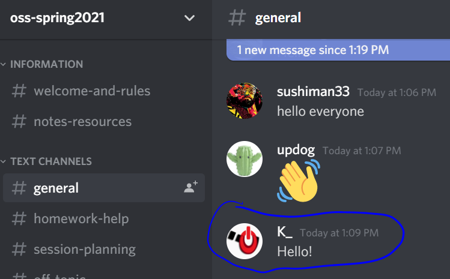
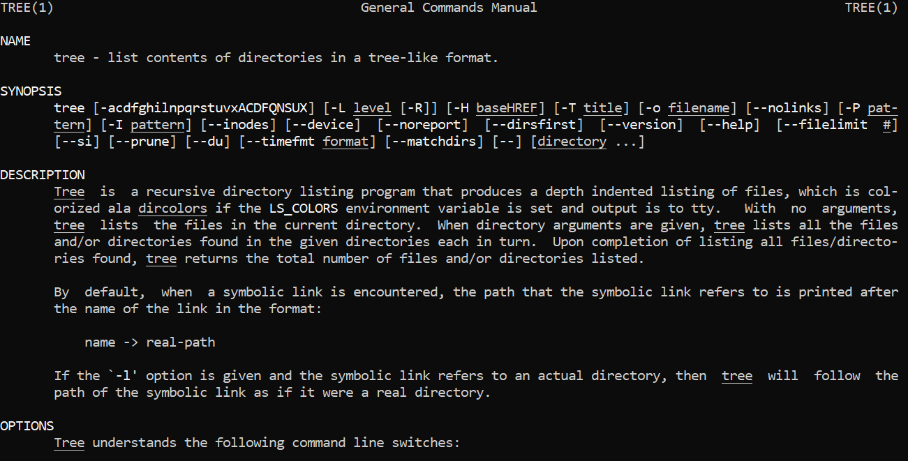

# Lab 01 Report - Introduction to Open Source Software

#### Note that Part 1 of this lab was filled out in , and then the rest of the work continues here.
#### My post to Discord:
# 

# Reading Assignments
#### The Open Source Definition sets an important standard, a high standard. Free redistribution is probably the most obvious part of the definition, but one criterion that surprised me was that the license must not restrict other software (#9). 
#### Smart Questions's introduction blew me away with how accurately it depicted sites like StackOverflow- people are willing to help and say "Good question," but only if the user has put in the work and doesn't ask a question that has already been answered twice over.
#### Two more suggestions for Answering Questions in a Helpful Way:
 * If a question can be answered in multiple ways, or there are multiple solutions, point some of them out! Other users tend to add solutions in case the first solution fails.
 * When a question points out a known issue, don't just say it's a known bug- pass it along to the software maintainer and let them know the bug is still ongoing.
## Free Culture, chapter 3:
#### What is strangest to me is why this chapter was titled 'Catalogs,' as opposed to 'Thieves,' 'Villains,' or something more accurate. In fact, 'Catalogs' never appears once within the body of chapter 3, but that isn't as important. Some of the key takeaways I've drawn from this chapter include, first and foremost, that there are people and corporations that will disagree *violently* with the idea of making some software free or otherwise public. It's tragic how Jesse's RPI intranet project ended, and thoroughly unconscionable to bankrupt multiple families. Perhaps the second takeaway is specifically just how bad the RIAA is (or was): "throughout, the RIAA insisted it would not settle the case until it took every penny Jesse had saved." I would absolutely have titled this chapter as 'Villains.' Finally, it paints a disturbing look at the U.S. justice system, especially Jesse's 'mafia-like choice:' to win, or to settle. I realize only one of these takeaways is about technology, but that was the goal of this chapter, at least to me. This chapter talks about the consequences of technology and tinkering, and hits closer to home from having happened to an RPI student.
# Linux
#### Tree is installed. Man page for tree:
# 
