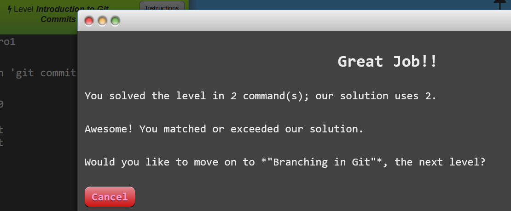
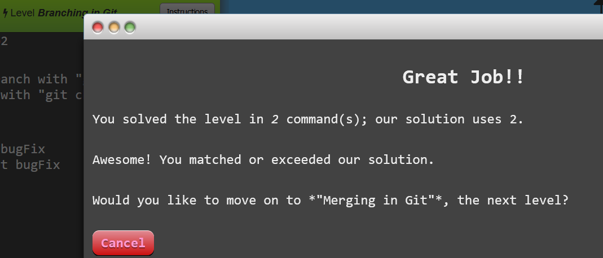
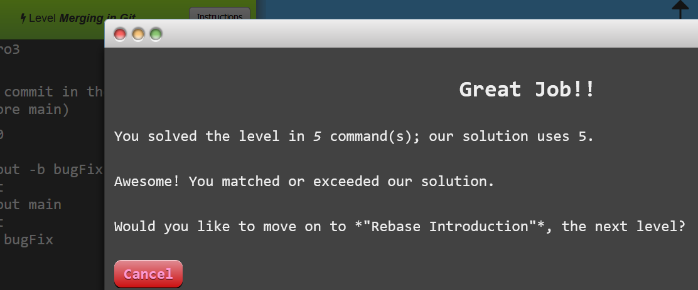
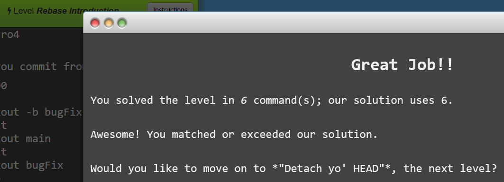

# Lab 02 Report - Introduction to Open Source Software

# Part 1
#### Git repo: lab2part1 

#### First.py: master, mars, jupiter:
#### 
#### 

# Part 2
#### The Spoon-Knife 
### Learn Git Branching: first 4 levels
#### 
#### 
#### 
#### 

# Part 3
#### The PullReq 
