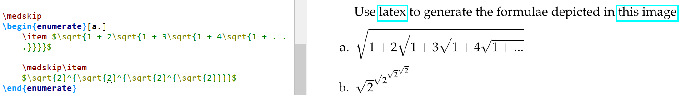
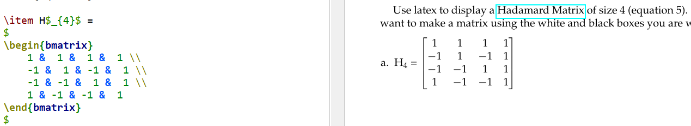
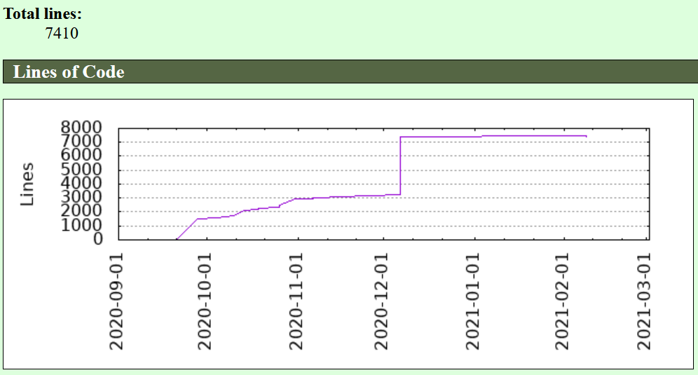
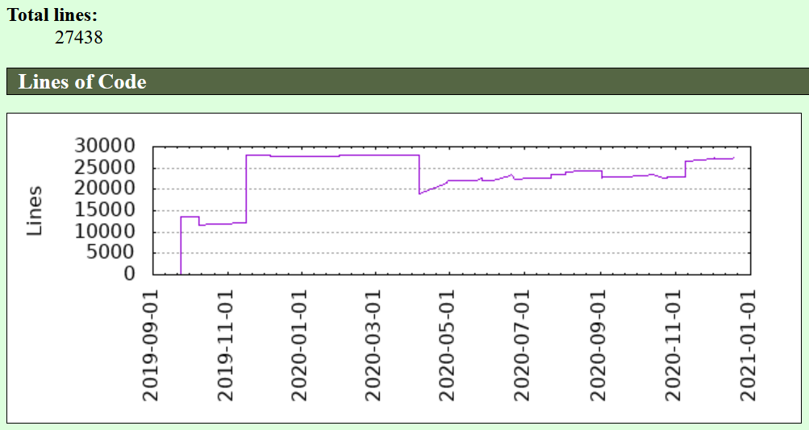
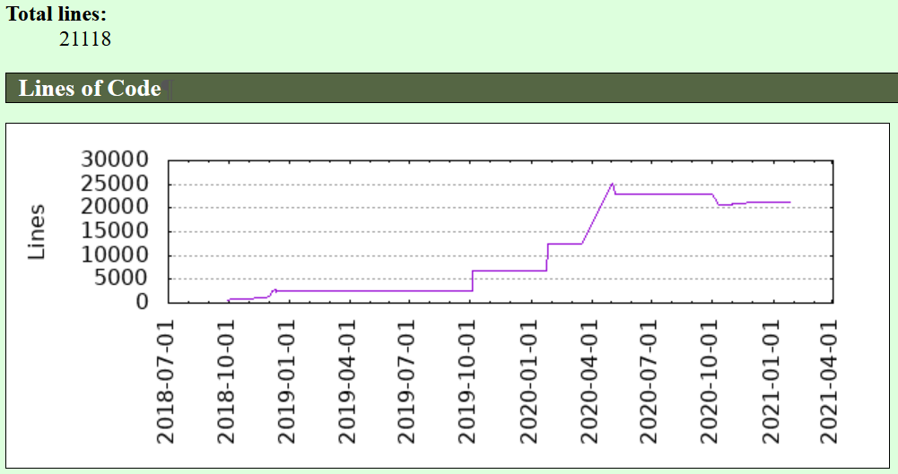
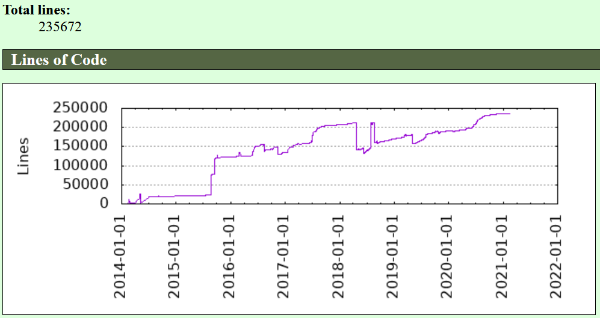
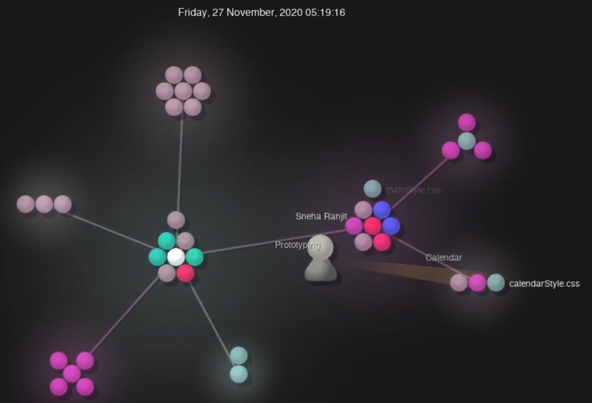
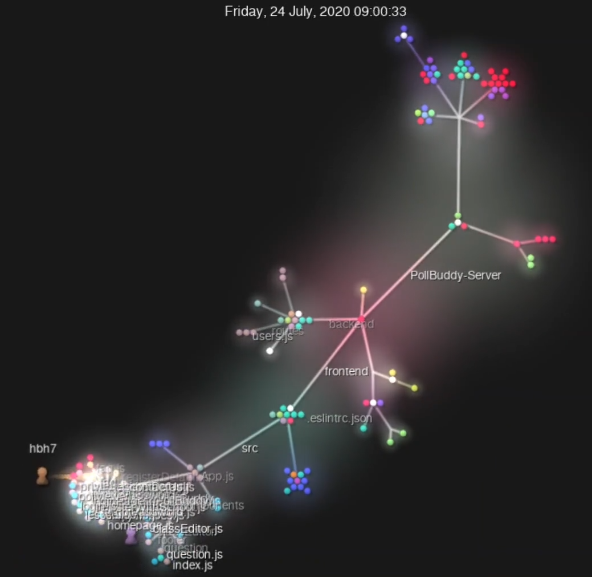
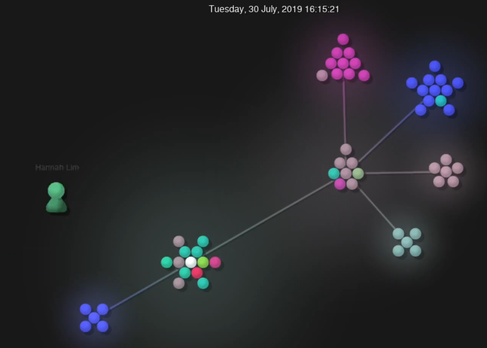
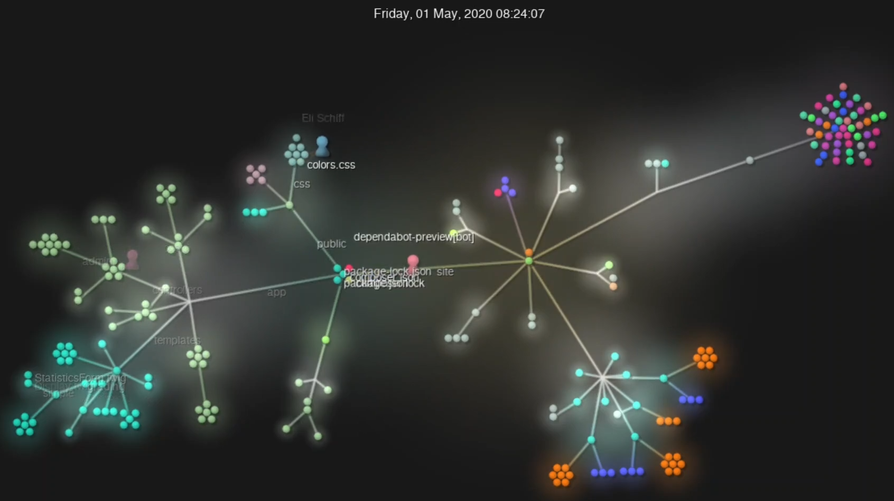

# Lab 03 Report

# Part 1
My repo's [wiki entry](https://github.com/KKhaghani/oss-repo-template/wiki)

Latex:

If you want to see the full .tex file, [click here](lab3.tex).

# Part 2
Projects I'm looking at:

[Exalendar](https://github.com/natsr4/exalendar)
* 6 contributors
* 58,269 total lines of code
* First commit: 9/15/2020 - "Initial commit" by NatSR4
* Latest commit: 2/8/2021 - "Merge remote-tracking branch 'origin/master'" by NatSR4
* Current branches: 8, 7 active

[Poll Buddy](https://github.com/pollbuddy/pollbuddy)
* 24 contributors
* 28,239 total lines of code
* First commit: 9/17/2019 - "Initial commit" by neha-deshpande001
* Latest commit: 12/18/2020 - "Merge branch 'backend'" by hbh7
* Current branches: 10, 9 active

[RPI Campus Map](https://github.com/gaskij/rpicampusmap)
* 12 contributors
* 37,207 total lines of code
* First commit: 9/28/2018 - "Initial commit" by gaskij
* Latest commit: 1/26/2021 - "Merge pull request #153 from gaskij/dependabot/. . ." by gaskij
* Current branches: 12, 7 active

[Submitty](https://github.com/submitty/submitty)
* 129 contributors (soon to be 130!)
* **702,097** total lines of code
* First commit: 1/31/2014 - "init commit" by Jesse Freitas
* Latest commit: 2/15/2021 - "`[DevDependency]` Bump eslint from 7.19.0 to 7.20.0 in /site" by dependabot
* Current branches: 132, 36 active

Now compare these to the [gitstats](https://github.com/hoxu/gitstats) pages for each:

Exalendar:

Poll Buddy:

RPI Campus Map:

Submitty:

How they compare:

The biggest discrepancy between all of these, but especially for Exalendar, is the line count: clearly, gitstats disagrees with the `git ls-files -z | xargs -0 wc -l` command. Beyond that, it's very interesting to see the line count fluctuate over time. We can see that Exalendar roughly doubled back in December, and that for about three months of 2018, Submitty *dropped* 50,000 lines of code! Cool!

Gource:

All gource videos are uploaded as unlisted YouTube videos, click the links below!

Exalendar

Poll Buddy (sped up 3x in post)

RPI Campus Map

Submitty (parts of video cut to shorten duration)

All of these gource videos are really neat! It lets us view the organizational structure of a project in a whole new way, and we can see how it's varied in time. Part of me wants to use gource more for other repos, but at the same time I encountered issues recording the .ppm videos, and thus this part of the lab took an exorbitant amount of time. Regardless, a very cool tool!
