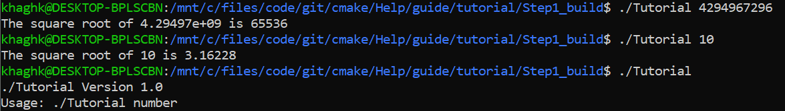
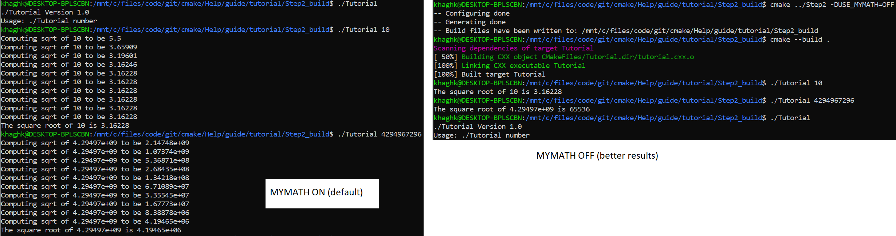
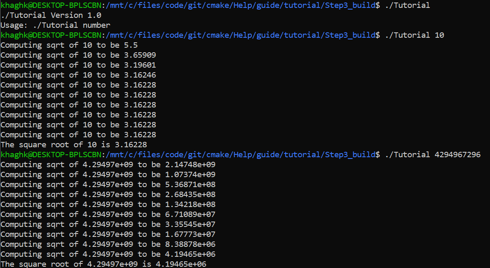
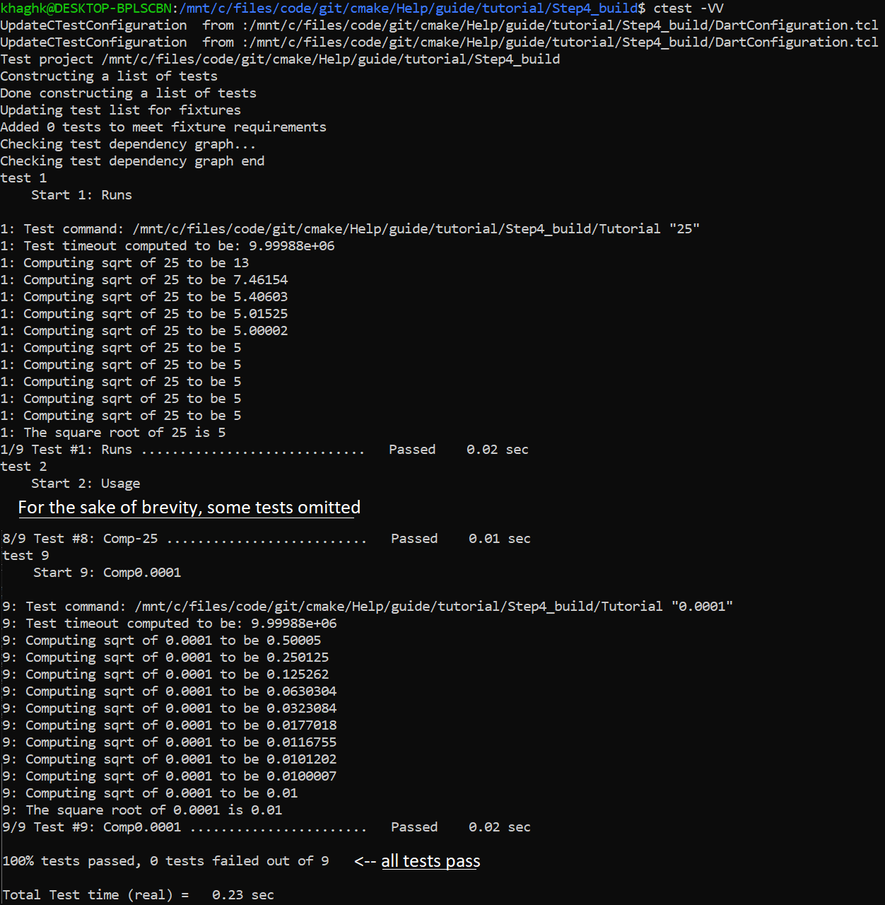
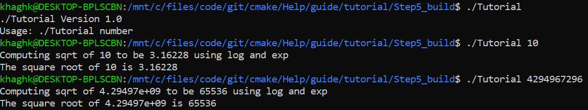
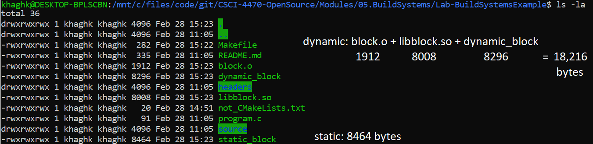

# Lab 05 Report

# Part 1: CMake tutorial

Files for step 1 can be found in the .

Step 1: Running tutorial

Step 2:  | comparing mysqrt and sqrt

Step 3:  |  | once again running Tutorial

Step 4:  | running (most of the) tests with ctest

Step 5:  | running Tutorial (it does find log and exp)

# Part 2: Makefiles

Creating my own Makefile:  | 

Relative sizes of static vs shared (dynamic) executables:

