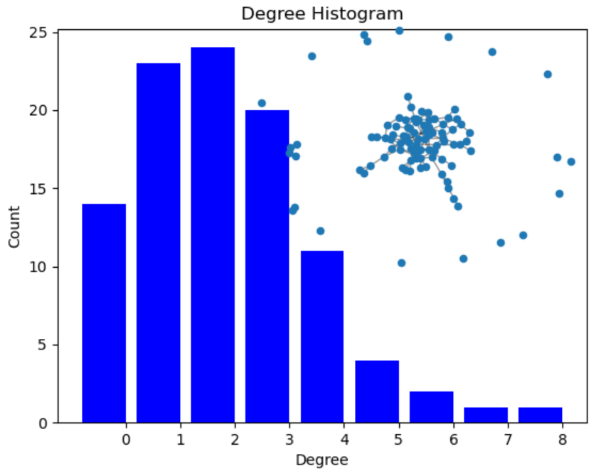

# Lab 06 Report

# Part 1: Setup

Matplotlib, networkx installed, and a basic understanding of networkx was obtained [from](https://networkx.org/documentation/stable/tutorial.html) [these](https://networkx.org/documentation/stable/auto_examples/index.html) [tutorials](https://networkx.org/documentation/stable/reference/index.html).

Ran the [degree histogram](https://networkx.org/documentation/stable/auto_examples/drawing/plot_degree_histogram.html#sphx-glr-auto-examples-drawing-plot-degree-histogram-py) example, output is below:

